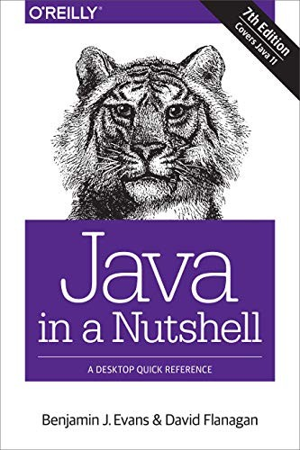
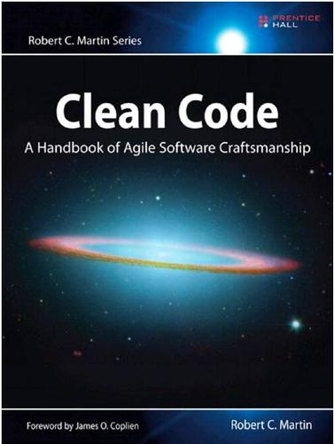

# Resources
Some resources for learning the technologies and the craft we work with.

## Books to read

[Beginning Jakarta EE](https://www.oreilly.com/library/view/beginning-jakarta-ee/9781484250792/)

Covers most of the basics needed to learn how to work with Java and Jakarta Enterprise. Including the database layer, enterprise beans, security and REST services.

  

[Java in a Nutshell](https://www.amazon.com/dp/1492037257)

Great book covering the essentials of Java. A good entry-point when you need to learn the syntax but already know the basics of other language(s).

  

## Software design books

[Clean Code: A Handbook of Agile Software Craftsmanship](https://www.amazon.com/dp/0132350882)

Even bad code can function. But if code isn’t clean, it can bring a development organization to its knees. Every year, countless hours and significant resources are lost because of poorly written code. But it doesn’t have to be that way.

  

[The Inmates Are Running the Asylum](https://www.amazon.com/dp/0672326140)

Alan Cooper on why high-tech products are so hard to use, and how designing for the people who use them, before any code is written, restores the sanity.

  

## Tools
We recommend [Vim](https://www.vim.org/) or [GNU Emacs](https://www.gnu.org/software/emacs/) for editing code. Pick one and learn it
well.

[spyc](https://github.com/adeptum-labs/spyc) is a terminal viewer for browsing code bases, and the tool we recommend for coding
with AI and for reviewing what it produces. It is useful whether AI is used or not, but especially important when it is. It shows the project overview, the files as a tree, the code with colors, the history
and blame from git, all uncommitted changes as one diff and what the tests ran from the coverage reports. Press `G` for the
dependency graph, where the packages of the project are drawn as layered boxes with what depends on something above it, and
`c` in the graph finds dependency cycles. Java, Kotlin, Python, JavaScript, TypeScript, Go, Rust, C and C++ are read, and test
files are left out until `t` shows them. See the
[AI Code of Conduct](AICodeOfConduct.md) for how to use it when reviewing.

## Technology stack
[Payara Server](https://www.payara.fish/) • [Maven](Maven.md) • [PrimeFaces](https://www.primefaces.org/) • [Lombok](Lombok.md) • [Apache DeltaSpike](https://deltaspike.apache.org/)

[PrimeFaces](https://www.primefaces.org/) is what we use for fullstack Java/Jakarta EE development.

Make sure you can create a minimal Jakarta EE project with Maven and deploy it locally in Payara. Please get familiarized with the above stack, how they work and how they relate.
